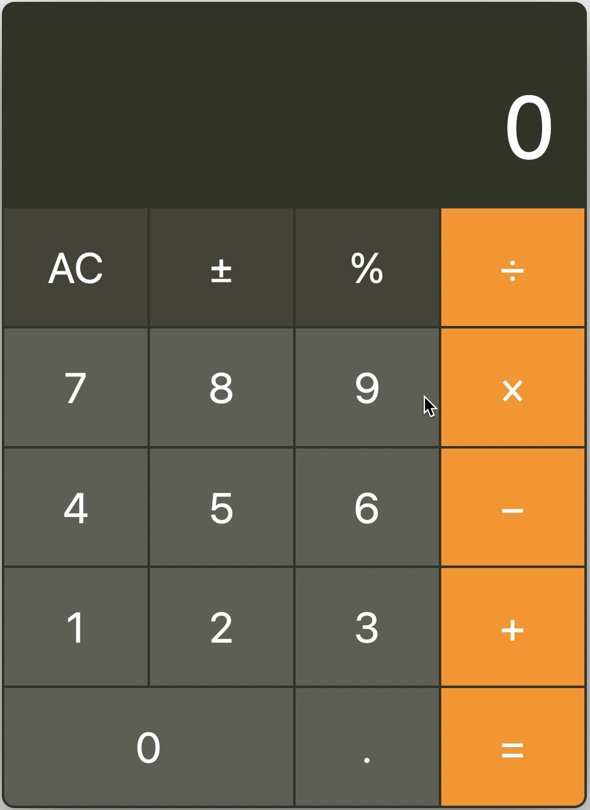

# [React Calculator](https://react-calculator-victoriatiller.netlify.app)

<!--  -->

Used javascript with react hooks to create simple calculator app. Can add, subtract, multiply, and divide two numbers.

(as of this moment, the +/-, %, and . buttons don't work yet)
